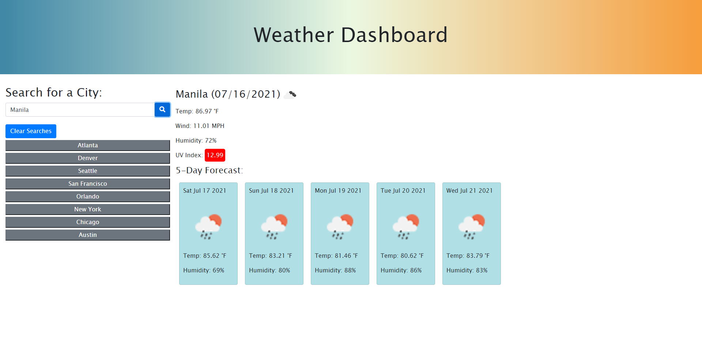

# Weather-Dashboard
This web app displays weather outlooks for multiple cities allowing travelers to plan their trips accordingly.

## Features
```
The user searches for a city and is presented with current conditions and a five day forecast for that city.
On the main display is the city name, the date, an icon representation of weather conditions, the temperature, the humidity, the wind speed, and the UV index.
The color of the UV index indicates whether the conditions are favorable(green), moderate(yellow), or severe(red).
On the five day forecast the user can view the corresponding dates, weather icons, temperature, wind speed, and humidity.
The cities that the user searches for is added to the search history and will show up once the user reloads the web page.
The user can click on a city in the search history which will prsent the current conditions and five day forecast for that city.
A button to clear searches is placed between the search bar and search history which deletes the user's search history.
```

## Screenshot


## Libraries and APIs
```
Bootstrap
Font Awesome
jQuery
Moment.js
OpenWeather One Call
```

## Link to project:
https://ronarceo.github.io/Weather-Dashboard/